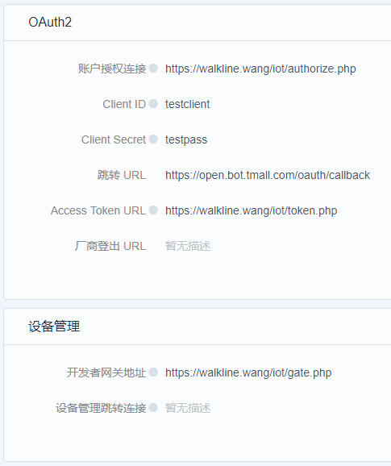

# IoT Platform

## 介绍
自己做的物联网平台（夸大其词），可以使用天猫精灵接入并使用语音控制物联网设备（痴心妄想）

## 使用说明
简单描述一下。。。。

### 天猫精灵服务器配置

### 授权文件说明
1. `authorize.php`: 平台通过此文件换取 `Authorize Code`
2. `token.php`: 平台使用 `Authorize Code` 获取 `AccessToken`
3. `gate.php`: 平台向物联网平台发送 `发现、控制、查询` 等命令时通过此文件进行响应
